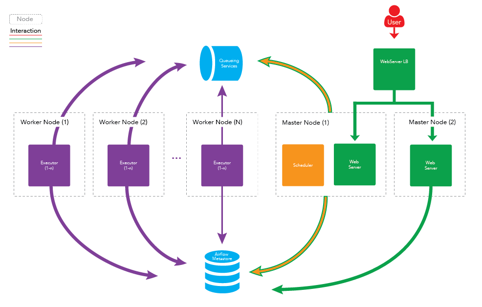

## Apache Airflow

Installation

Phase 1

Use Master-B1 for Airflow SIT / Master-B2 for Airflow PRD
0. Create User Airflow
   ```
   sudo -iu hadoop
   sudo adduser airflow
   # sudo visudo: give sudo access to airflow
   sudo -iu airflow
   ```
1. Install Miniconda

    ```
   cd /opt
   wget https://repo.anaconda.com/miniconda/Miniconda3-latest-Linux-x86_64.sh
   sudo bash Miniconda3-latest-Linux-x86_64.sh -b -f
   /opt/miniconda3/bin/conda create -n airflow python=3.9 -y
   
    ```

2. Log into RDS database and create database and database user

   ```
   create database if not exists airflow;

   create user if not exists 'airflow' identified by 'nVNG#w6+7x>g';

   grant all privileges on airflow.* to 'airflow';
   ```


3. Install Airflow
   ```
   conda activate airflow
   pip install "apache-airflow[celery]==2.3.2" --constraint "https://raw.githubusercontent.com/apache/airflow/constraints-2.3.2/constraints-3.7.txt"
   yes | pip install mysqlclient pyspark pandas numpy
   ```

4. Config Airflow
   ```
   # either use export or vi config
   # export AIRFLOW__WEBSERVER__BASE_URL=http://localhost:8888
   # export AIRFLOW__WEBSERVER__WEB_SERVER_PORT=8888
   # export AIRFLOW__DATABASE__SQL_ALCHEMY_CONN=mysql+mysqldb://airflow:nVNG#w6+7x>g@app-mpdw-sit-rds.ckdkjufyghml.us-west-2.rds.amazonaws.com/airflow
   
   # start server   
   airflow scheduler -d
   airflow webserver -D
   airflow users create --role Admin --username admin --email admin --firstname admin --lastname admin --password admin
   
   export SPARK_HOME="/usr/lib/spark"
   export PYSPARK_PYTHON=~/.conda/envs/airflow/python
   export PYSPARK_DRIVER_PYTHON=$PYSPARK_PYTHON
   # export PYTHONPATH=${SPARK_HOME}/python/:$(echo ${SPARK_HOME}/python/lib/py4j-*-src.zip):${PYTHONPATH}
   ```
5. Git Pull Job Repo


Phase 2


